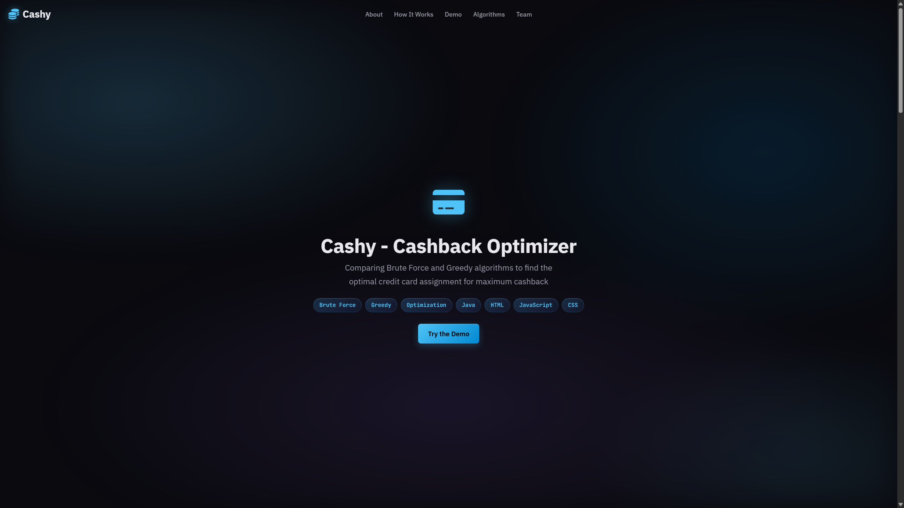

# Cashback Optimizer

An algorithms course project that finds the optimal assignment of spending categories to credit cards in order to maximize total cashback. Compares Brute Force and Greedy approaches side-by-side.



---

## Tech Stack

- **Language:** `Java`, `JavaScript`
- **Frontend:** `HTML`, `CSS`, `JavaScript`
- **Build (Java):** Single-file compilation (`javac`)
- **Libraries:** AOS (scroll animations)
---

## Features

- **Brute Force Algorithm** — Enumerates all possible category-to-card assignments (base-N combinatorics) and selects the one that maximizes cashback while respecting per-card spending limits. Skips automatically if the search space exceeds 10,000,000 assignments.
- **Greedy Algorithm** — Sorts categories by spending amount (descending) and assigns each to the card offering the best cashback rate without exceeding its limit.
- **Interactive Web Demo** — A browser-based interface where users can input their own cards, categories, spending amounts, limits, and cashback rates, then run both algorithms and compare results in real time.
- **Side-by-side comparison** — Both algorithms run on the same input and display formatted results tables showing category, amount, rate, assigned card, and cashback.
- **Input helpers** — Load a pre-built example, randomize inputs, or enter custom values.
- **Outcome explanations** — The demo explains three possible outcomes: both algorithms agree, one finds a better solution, or no valid assignment exists.

---

## Process

1. Defined the problem: given N cards, M spending categories, per-card limits, and a rates matrix, maximize total cashback.
2. Modeled Brute Force by converting assignment indices to base-N representations, enumerating all valid permutations.
3. Modeled Greedy by sorting categories by spend (high to low) and greedily picking the best available card per category.
4. Added a hard cap to Brute Force to prevent memory/time blowout on large inputs.
5. Re-implemented both algorithms in JavaScript and built an interactive web demo with editable input tables and side-by-side results.
6. Submitted as a group project (3 members) for the Algorithms course.

---

## Running the Project

### Web Demo

Open `docs/index.html` in a browser — no build step required.

### Java Console App

```bash
# Compile
javac Algorithms_Cashback_Project.java

# Run
java Algorithms_Cashback_Project
```

Follow the console prompts to enter:
- Number of cards and categories
- Spending amounts per category
- Per-card spending limits
- Cashback rates matrix (cards x categories)

Both Brute Force and Greedy results will be printed automatically.

---

## Team

- Khalid Al Dosari
- Zeyad bin Nazir
- Abdulellah Altowaijri
